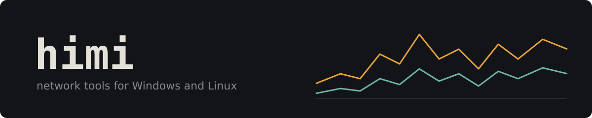

I write small tools for Windows and Linux, mostly around networking.
C# and .NET most of the time, plus Go, Java, C++, Python and JavaScript.

## Projects

- [leash](https://github.com/himi9046-hub/leash): see which apps on your PC talk to the internet, how much and where, and block any of them in one click. C#, WPF, ETW.
- [sockscope](https://github.com/himi9046-hub/sockscope): live network traffic per process on Linux, counted in the kernel with eBPF. Go collector, JavaFX viewer.
- [churnmap](https://github.com/himi9046-hub/churnmap): finds the files in a git repo that change too often and are too big. Node.js, no dependencies.

## Next up

- A tiny TCP/IP stack in C++ on top of a TAP adapter, to see how packets really move.
- A pcap viewer in Python: open a capture, see who talked to whom.
- A LAN chat with file transfer in Java, plain sockets.

## Learning

Foundational C# with Microsoft, Cisco Networking Basics.
